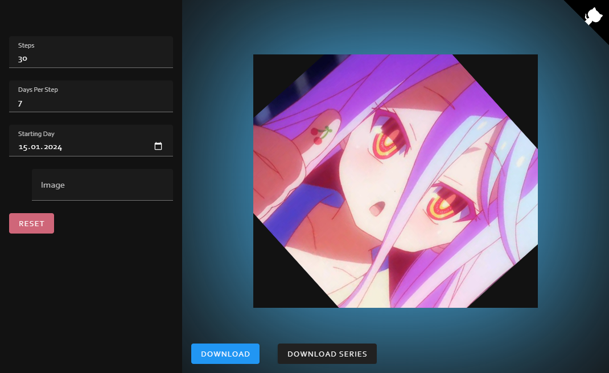

# ProfileSpinner

Rotate your profile picture to keep profile pictures interesting.  
All data is stored locally in your browser.  

Rotate your profile [now](https://h0rn0chse.github.io/ProfileSpinner/)!

 

- Set steps and step size
- Set your starting day and get everyday your current rotation
- Export all rotations

## Libraries

- Github Corners [github.com/YuskaWu/github-corner-element](https://github.com/YuskaWu/github-corner-element)
- Zip [github.com/Stuk/JSZip](https://github.com/Stuk/jszip)
- UI Framework [vuejs.org](https://vuejs.org/)
- State Management [pinia.vuejs.org](https://pinia.vuejs.org/)
- Storage [Dexie.js](https://dexie.org)
- Component Library [next.vuetifyjs.com](https://next.vuetifyjs.com/en/)
- Packaging [vitejs.dev](https://vitejs.dev/)
- Font Stack [github.com/system-fonts/modern-font-stacks](https://github.com/system-fonts/modern-font-stacks)
